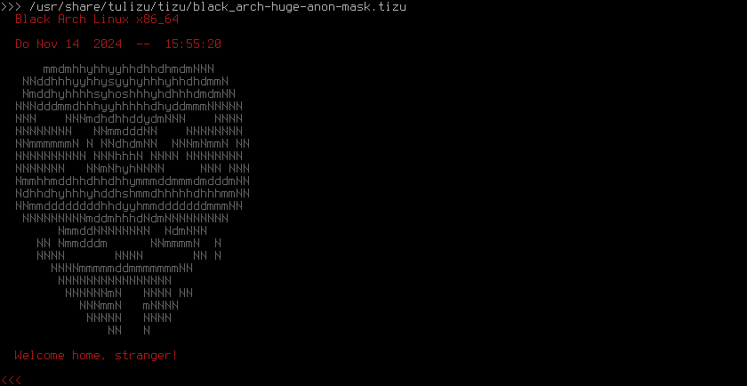
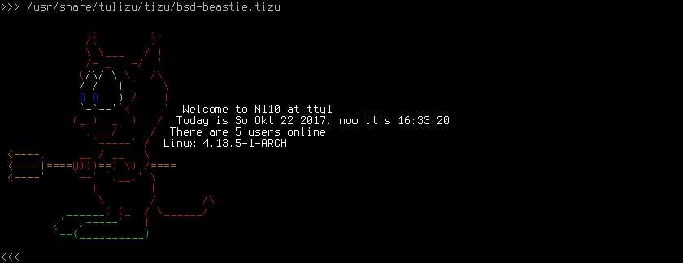
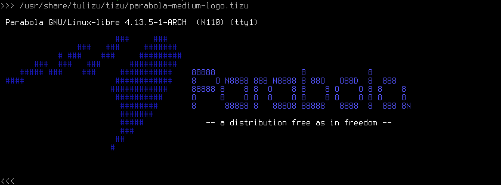

**tulizu** is a pure bash script to view and switch getty issue files.
Furthermore it may helpful at the creation process of such an issue file when
there are ASCII arts included.

For this purpose **tulizu** uses its own tizu file format which allows to set
options for different kind of resulting issue file.

**tulizu** is shipped with a modest collection of ASCII art issue/tizu files
ready to use for Arch Linux users and some samples for other systems.

You are cordially invited to include _your_ fancy issue/tizu file to **tulizu**
to help to build a nice data base of issue/tizu files.

It's name, if it is not clear, is a quibble of 'issue tool' and is in such to be
pronounced contracted like 'toolishoo'.

**Last version is v0.3, May 2025**

### Available Issues For Systems

The number in parentheses indicate how many tizu files are available.

  - Arch Linux (9)
  - Black Arch (1)
  - BSD (1)
  - Debian (3)
  - Parabola (1)
  - Raspberry Pi (2)

### Screenshots

These shots are here to give you an idea what you will get. Sometimes they are
slightly fake to make it easier for me, or they are a little out of date in
terms of the names you see. So don't be surprised if you can't reproduce the
exact output.

#### A brief glimpse of the collection

#### List available files matching "arch*tizu"

#### Show details of files

#### Show variations of files using different color settings

#### tulizu with tbsm

That's how my screen looks after login ready to go with
[tbsm](https://loh-tar.github.io/tbsm/).

### Further Readings

All details about **tulizu** you can find in the
[doc directory](https://github.com/loh-tar/tulizu/tree/master/doc).

### Install

See README of the [project page](https://github.com/loh-tar/tulizu)

### License

GNU General Public License (GPL), Version 2.0
